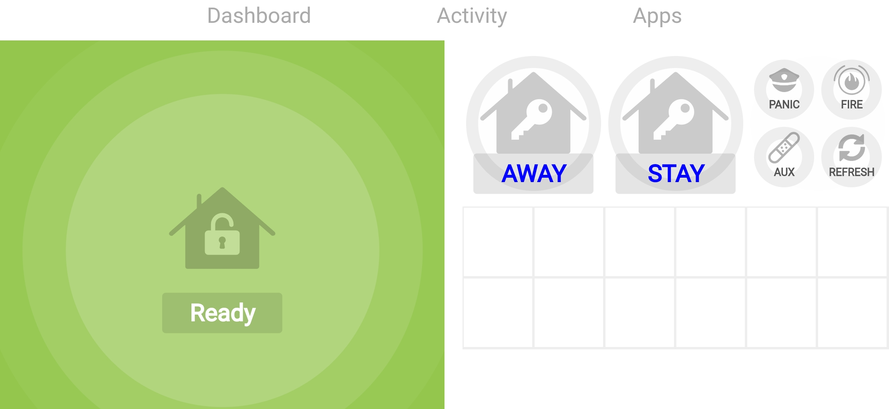
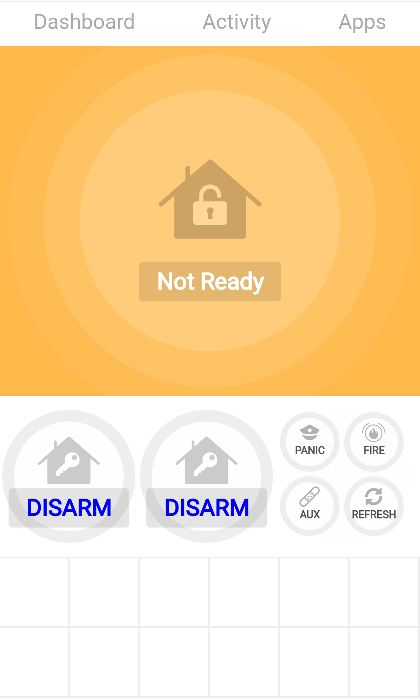
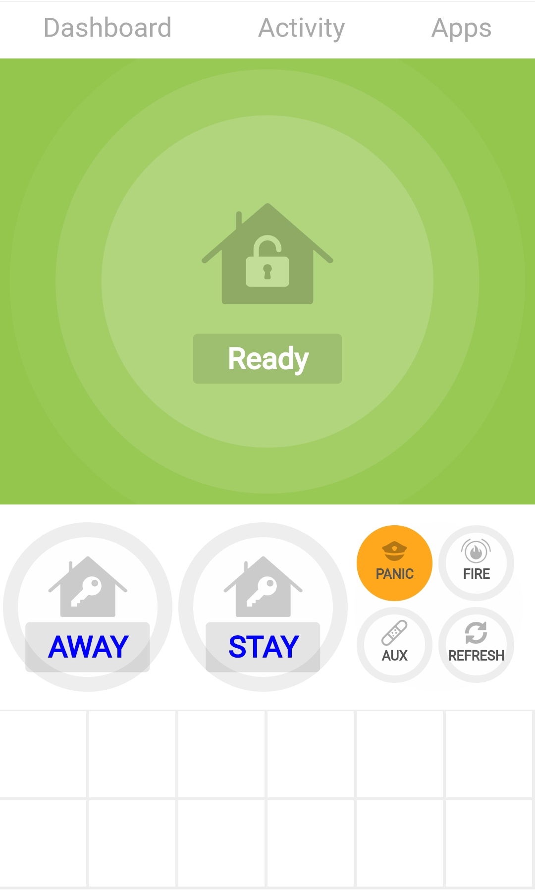
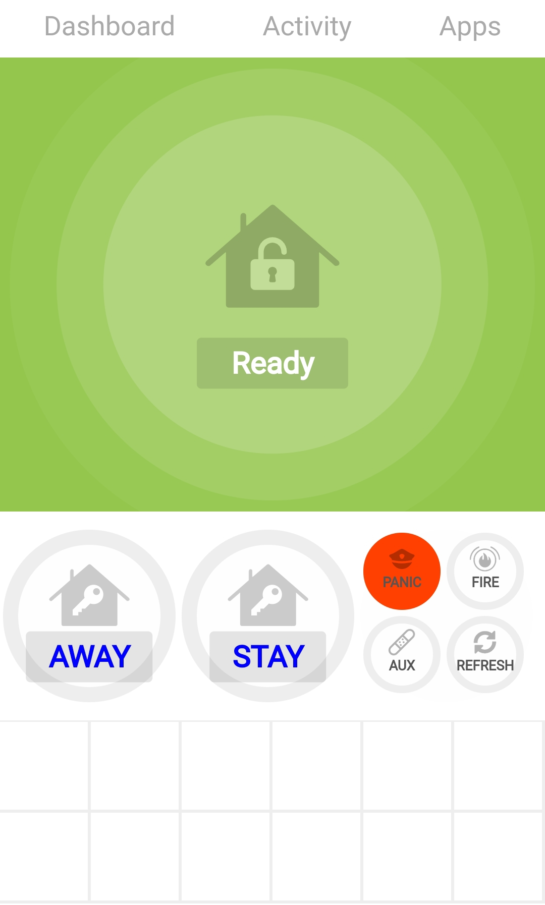
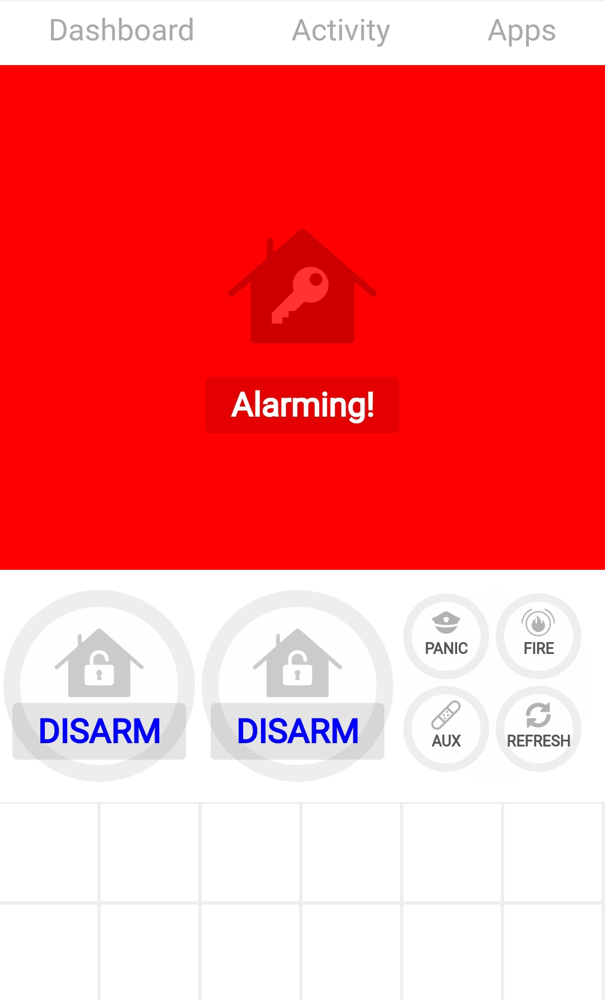
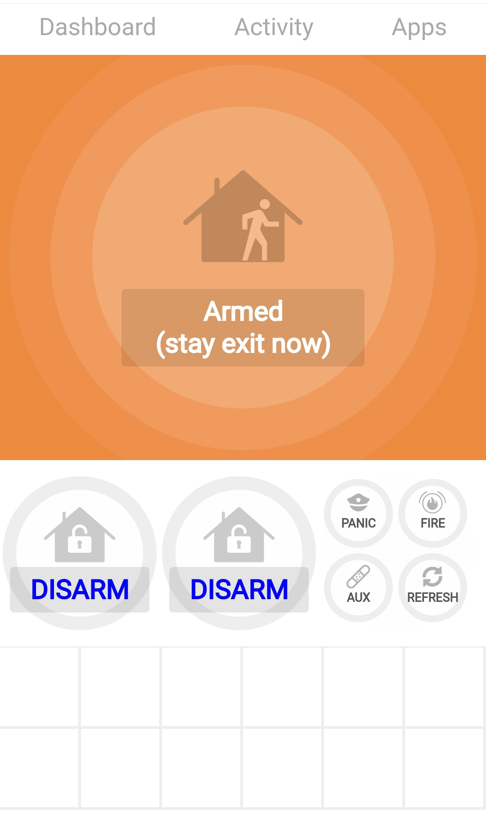

# HTML5 WebSocket based user interface app.html
<p>
</p>

## Setup.
Copy the contents of flash-drive folder into the root directory of a uSD flash drive formatted with a fat32 filesystem on a single MSDOS partition. Place this uSD flash drive into the ESP32-POE-ISO board and reboot.

To access the web interface connect to the IP address or host name of the ESP32-POE-ISO board that is configured with the 'webui' build of the AD2IoT firmware.
## Arguments
- codeID : The codeid slot to use on the AD2IoT for arming etc.
- vpartID : The vpart slot to use for this virutal keypad. If vpart is configured for address 18 then this virtual keypad will show that keypads partition state.
- wsHost : To allow for easy development you can access the app.html using the browser file:///~/AlarmDecoder-STSDK/contrib/webUI/flash-drive/app.html?vpartID=0&codeID=0&wsHost=192.168.0.20 so the websocket connection will be to the ESP32-POE-ISO board but html content from a local filesystem.

## Examples
-   http://192.168.0.1/app.html?vpartID=1&codeID=1
-   http://192.168.0.1/app.html
    - Defaults to vPartID 0 and codeID 0

## Templates
Creating a file ex "index.html" with the same name but add .tpl extension ex "index.html.tpl" will cause
the web server code to process the file as a template.

The file can be zero length.

Enable template processing for index.html then upload the sketch data.
  \> touch index.html.tpl

### Template macros
```
 ${0}  - Device Version string
 ${1}  - Uptime string DDDDd:HHh:MMm:SSs
 ${2}  - This device ipv4 address HOST
 ${3}  - Web client ipv4 address
 ${4}  - Protocol [HTTP/HTTPS]
 ${5}  - Device UUID
 ${6}  -
 ${7}  -
 ${8}  -
 ${9}  -
 ${10} -
```

## Pre compressed files.
Files with .gz extension will be returned when the partial request file is used.
ex. /favicon.ico will be sent from favicon.ico.gz if it exists and the server
will inform the client on the stream being compressed data so it can decompress it.

## Examples






